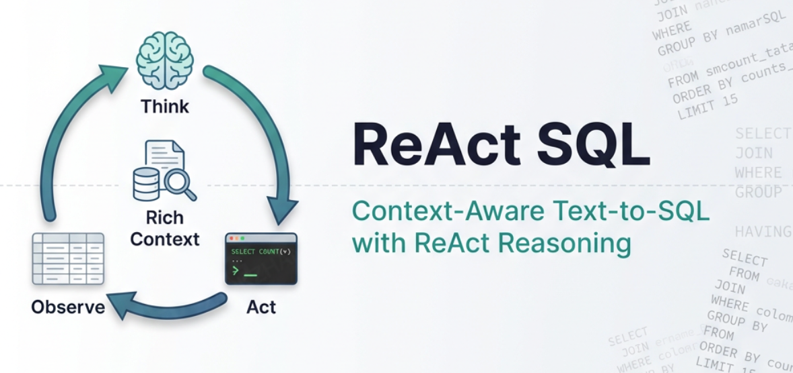
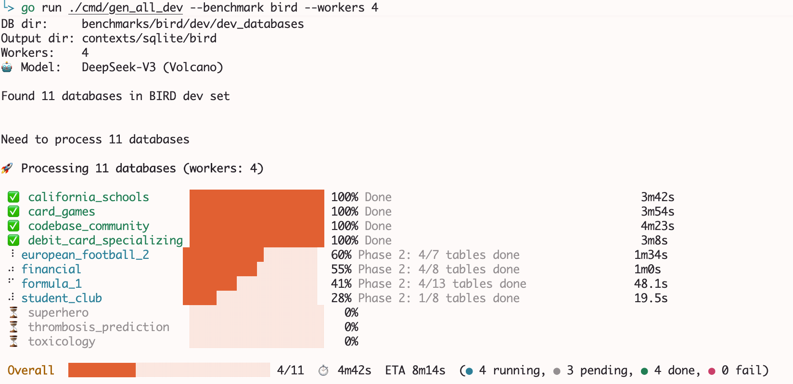

# ReAct SQL

<p align="center">
  
</p>

<p align="center">
  A Text2SQL experiment framework built on the <b>ReAct paradigm</b> and <b>Rich Context</b>.<br/>
  Achieves <b>94.39%</b> execution accuracy (EX) on the calibrated Spider 1.0 dev set.
</p>

---

## Quick Start

```bash
# 1. Clone & download datasets
git clone <repo-url> && cd ReActSqlExp
bash scripts/download_datasets.sh

# 2. Configure LLM API
cp llm_config.json.example llm_config.json
# Edit llm_config.json — fill in your API Key (any OpenAI-compatible model)

# 3. Run evaluation (interactive menu)
go run ./cmd/eval
```

The interactive menu will guide you through benchmark selection (Spider / BIRD) and evaluation mode:

```
📦 Select Benchmark
  1. spider  — Spider dev set (1034 examples)
  2. bird    — BIRD dev set (1534 examples)

🎯 Select Evaluation Mode
  1. baseline                   Direct SQL generation
  2. react                      Multi-step reasoning with tool use
  3. rich_context               Enhanced schema context
  4. react+rich_context         ReAct + Rich Context
  5. react+rich_context+linking Full pipeline with schema linking
  6. full                       All features enabled
```

## Rich Context Generation

<p align="center">
  
</p>

Rich Context is the core of this method — a multi-agent system automatically analyzes database structure and generates structured context (field semantics, JOIN paths, data characteristics, etc.).

```bash
# Interactive mode — select benchmark and generate
go run ./cmd/gen_all_dev
```

Pre-generated contexts for 20 Spider + 2 BIRD databases are included in `contexts/sqlite/`.

## Result Analysis

```bash
# Interactive mode — auto-discovers results, select and analyze
go run ./cmd/analyze_results
```

## CLI Overview

| Command                               | Description                                                 |
| ------------------------------------- | ----------------------------------------------------------- |
| `go run ./cmd/eval`                   | Run evaluation (Spider / BIRD, interactive)                 |
| `go run ./cmd/gen_all_dev`            | Generate Rich Context (interactive)                         |
| `go run ./cmd/analyze_results`        | Analyze evaluation results (interactive)                    |
| `go run ./cmd/gen_field_descriptions` | Generate result field descriptions for BIRD/Spider datasets |
| `go run ./cmd/extract_result_fields`  | (Legacy) Extract result field descriptions from Gold SQL    |

All commands support both **interactive mode** (no args) and **CLI mode** (with flags). Run with `--help` for details.

## Key Results

| Method           | Base Model     | EX (%)    |
| ---------------- | -------------- | --------- |
| DAIL-SQL + GPT-4 | GPT-4          | 86.6      |
| DIN-SQL + GPT-4  | GPT-4          | 85.3      |
| **ReAct SQL**    | **Qwen-3 Max** | **94.39** |

## Prerequisites

- **Go** >= 1.21
- **LLM API**: Any OpenAI-compatible endpoint (DeepSeek-V3, Qwen-3 Max, etc.)
- **curl** + **unzip**: For dataset download

## License

MIT License
